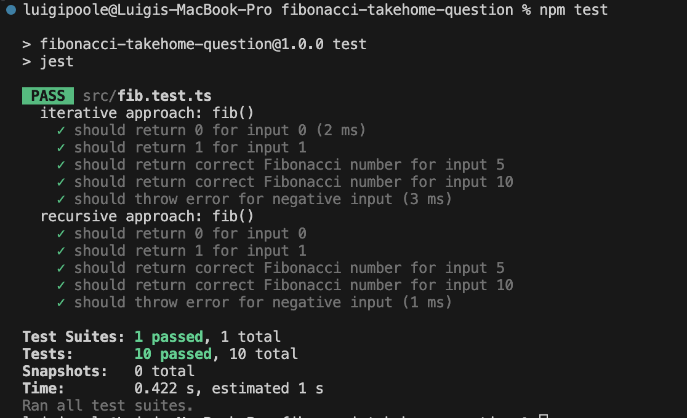

# Fibonacci Number Calculator

This project contains different approaches to calculate the nth Fibonacci number. Each approach has its own time and space complexity, and is suitable for different scenarios.

## Approaches

1. [Iterative Approach](./src/iterative-approach/README.md)
2. [Recursive Approach](./src/recursive-approach/README.md)

Please refer to the linked README files for detailed explanations of each approach, including their time and space complexities.

## Installation

To install this project, clone the repository and install the dependencies with your package manager of choice.

```bash
git clone https://github.com/luigiplr/fibonacci-takehome-question.git
cd fibonacci-takehome-question
npm install
```

## Running Tests

To run the tests for this project, use the following command:

```bash
npm test
```

